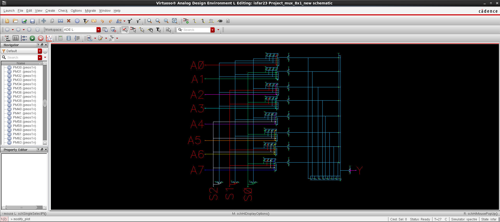
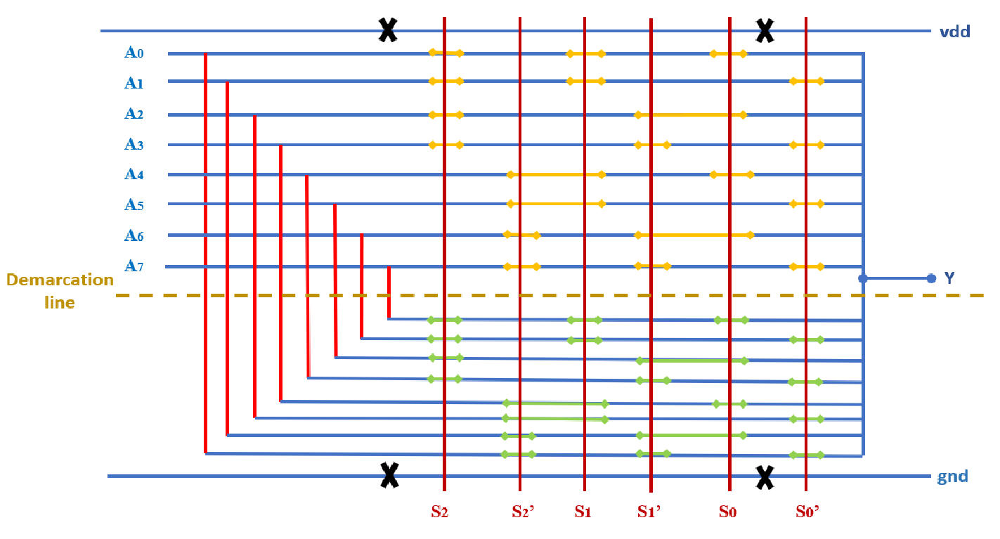

# 8x1 Multiplexer (MUX) - VLSI Design Project

## Overview
This repository contains the VLSI design and simulation results of an 8x1 Multiplexer (MUX) implemented using Cadence tools. The project includes schematic design, ADE simulations, power analysis, symbol representation, and stick diagrams.

## Project Components
### 1. Schematic Design
The schematic of the 8x1 MUX is created using Cadence Virtuoso. It represents the transistor-level implementation of the multiplexer.

**Figure:** 
The schematic of the 8x1 MUX is created using Cadence Virtuoso. It represents the transistor-level implementation of the multiplexer.

### 2. ADE Simulations
Cadence ADE (Analog Design Environment) is used to simulate the functionality of the 8x1 MUX. The waveform results validate the correct operation of the multiplexer.

**Figure:** 
Cadence ADE (Analog Design Environment) is used to simulate the functionality of the 8x1 MUX. The waveform results validate the correct operation of the multiplexer.

### 3. Power Analysis
The power consumption of the 8x1 MUX is analyzed by measuring the total power usage over time. This helps in evaluating the efficiency of the design.

**Figure:** 
The power consumption of the 8x1 MUX is analyzed by measuring the total power usage over time. This helps in evaluating the efficiency of the design.

### 4. Symbol Representation
A symbolic representation of the 8x1 MUX is generated to provide a high-level abstraction of the circuit.

**Figure:** 
A symbolic representation of the 8x1 MUX is generated to provide a high-level abstraction of the circuit.

### 5. Stick Diagram
A stick diagram is drawn to illustrate the layout-level structure of the multiplexer, providing insight into how transistors are arranged in a physical layout.

**Figure:** 
A stick diagram is drawn to illustrate the layout-level structure of the multiplexer, providing insight into how transistors are arranged in a physical layout.

## Project Artifacts
- **Schematic:** Representation of the 8x1 MUX circuit.
- **ADE Simulations:** Verification waveforms of the multiplexer.
- **Power Usage Report:** Analysis of power consumption.
- **Symbol Diagram:** High-level representation of the MUX.
- **Stick Diagram:** Transistor layout sketch.

## Tools Used
- Cadence Virtuoso
- Cadence ADE (Analog Design Environment)

## How to Run Simulations
1. Open **Cadence Virtuoso**.
2. Load the project schematic.
3. Open **ADE** for simulation setup.
4. Run the simulations and analyze the waveforms.
5. Check the power consumption results.

## Future Improvements
- Implement the layout design and perform DRC & LVS checks.
- Optimize the circuit for low power consumption.
- Extend the design for a larger multiplexer (e.g., 16x1 MUX).

## Contact
- LinkedIn: [Isfar Nayen](https://www.linkedin.com/in/isfar-nayen-0ba8ba341/)
- Kaggle: [Isfar Nayen](https://www.kaggle.com/isfarnayen)
- 🔗 GitHub: [Isfar Nayen](https://github.com/IsfarNayen)
- 📧 Email: isfar8953@gmail.com
---

This README serves as documentation for the Cadence-based 8x1 MUX project, providing a structured overview for GitHub showcasing.